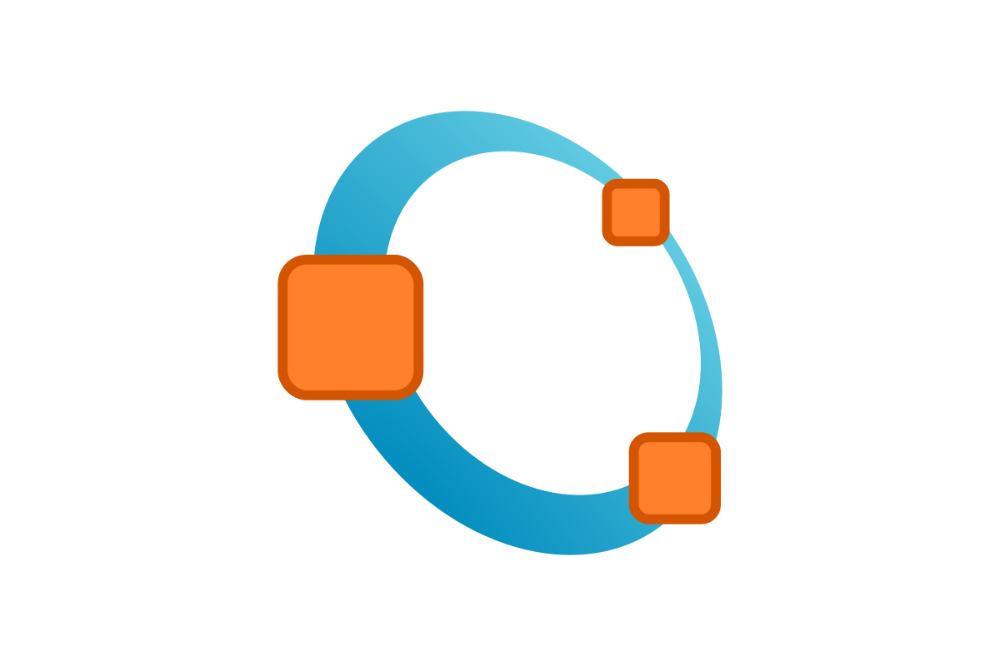

# UAb
List and links of projects made under the Computer Science and Engineering Bachelor Program of Universidade Aberta, Portugal.

| Curricular Unit | Projects |
| --------------- | :------: |
| Introduction to Programming | [Little Domino Puzzle](https://github.com/4ntony4/UAb_littleDominoPuzzle)    [Game of Words](https://github.com/4ntony4/UAb_gameOfWords)  |
| Programming Lab | [Student Enrollment Management](https://github.com/4ntony4/UAb_studentEnrollmentManagement)    [Rectangles' World](https://github.com/4ntony4/UAb_rectanglesWorld)  |
| Operating Systems | [Processes Tree](https://github.com/4ntony4/UAb_processesTree)    [Multithreading](https://github.com/4ntony4/UAb_multithreading)  |
| Object-Oriented Programming |  |
| Data Structures and Algorithms |  |
| Introduction to Artificial Intelligence |  |
| Programming Languages | [Patient Health Risk](https://github.com/4ntony4/UAb_patientHealthRisk)    [Small Sales Management](https://github.com/4ntony4/UAb_smallSalesManagement)     |
| Software Development Lab |  |
| Computer and Network Security | [Ciphers](https://github.com/4ntony4/UAb_ciphers)  |
| Computer Graphics | [Raster Display Simulation](https://github.com/4ntony4/UAb_rasterDisplaySimulation)   |
| Numerical Computation | [Fixed-Point Iteration](https://github.com/4ntony4/UAb_fixedPointIteration)    [Secant Method](https://github.com/4ntony4/UAb_secantMethod)  |