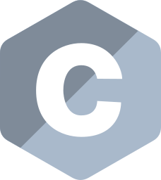

# UAb
List and links of projects made under the Computer Science and Engineering Bachelor Program of Universidade Aberta, Portugal.

| Curricular Unit | Projects |
| --------------- | :------: |
| Introduction to Programming | [Domino Puzzle](https://github.com/4ntony4/UAb_Domino-Puzzle)    [Game of Words](https://github.com/4ntony4/UAb_Game-Of-Words)  |
| Programming Lab | [Enrollment Management](https://github.com/4ntony4/UAb_Enrollment-Management)    [Rectangles' World](https://github.com/4ntony4/UAb_Rectangles-World)  |
| Operating Systems | [Processes Tree](https://github.com/4ntony4/UAb_Processes-Tree)    [Multithreading](https://github.com/4ntony4/UAb_Multithreading)  |
| Object-Oriented Programming | [Courses Management](https://github.com/4ntony4/UAb_Courses-Management)  |
| Data Structures and Algorithms |  |
| Introduction to Artificial Intelligence |  |
| Programming Languages | [Patient Health Risk](https://github.com/4ntony4/UAb_Patient-Health-Risk)    [Small Sales Management](https://github.com/4ntony4/UAb_Sales-Management)    [Streaming Platform Classes](https://github.com/4ntony4/UAb_Streaming-Platform-Classes)  |
| Software Development Lab |  |
| Computer and Network Security | [Symmetric Vs Asymmetric Encryption](https://github.com/4ntony4/UAb_Symmetric-Vs-Asymmetric-Encryption)  |
| Computer Graphics | [Raster Display Simulation](https://github.com/4ntony4/UAb_Raster-Display-Simulation)     [Cubic Bezier Curves](https://github.com/4ntony4/UAb_Cubic-Bezier-Curves)   |
| Numerical Computation | [Fixed-Point Iteration](https://github.com/4ntony4/UAb_Fixed-Point-Iteration)    [Secant Method](https://github.com/4ntony4/UAb_Secant-Method)  |